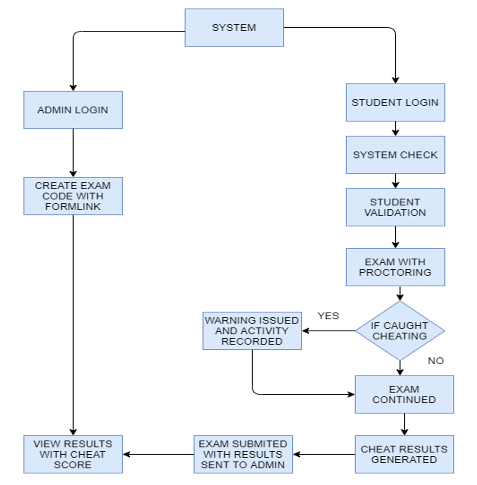
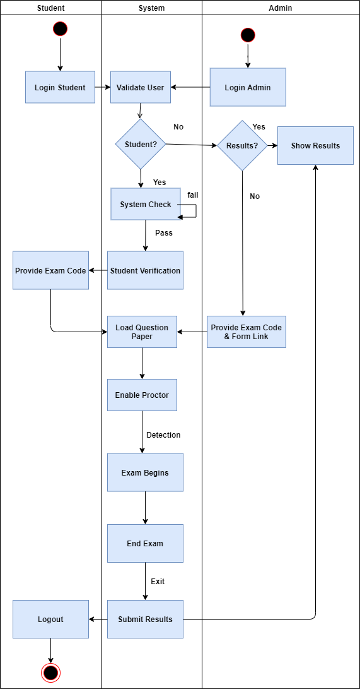
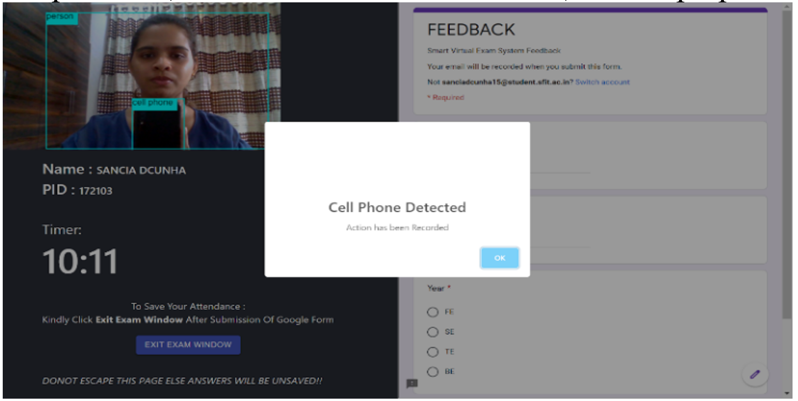
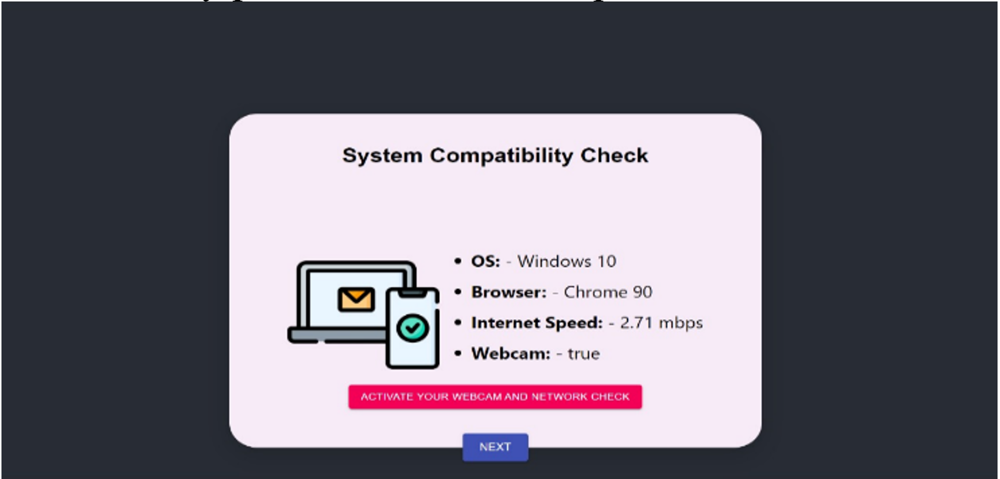
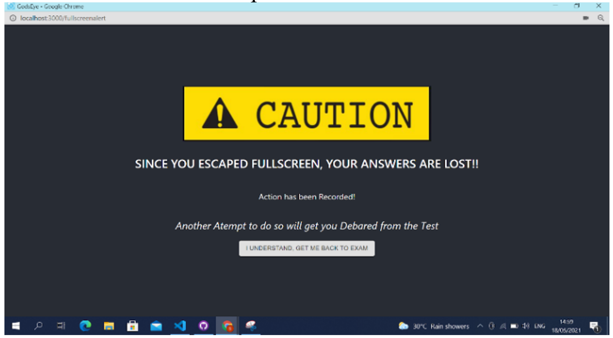
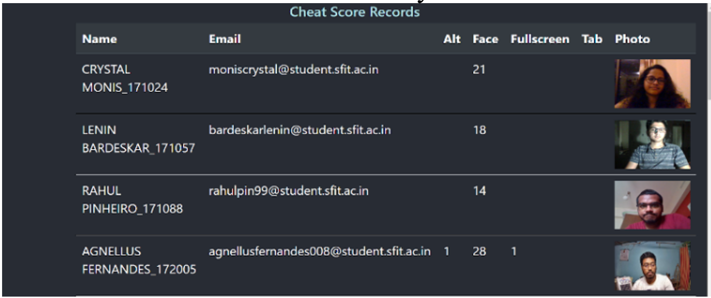

<!--  -->

# GodsEye
## Smart Virtual Exam System 
### Abstract
The Covid-19 Pandemic has been one of the defining events in recent history. It has affected millions of lives and has an impact on every sector of civilization. No matter the domain, the pandemic has forced it to implement radical and innovative reforms. Education and Academia has been identified as one such sector that has been impacted most adversely due to the Pandemic. Disrupting the age-old Classroom Design, the Pandemic has forced educational institutes and schools to implement ‘Online Classes’. A concept that has now been standardized, by many. However the evaluation aspect of education still  remains to be desired. There are no easy to use or accurate means of conducting examinations for students during this Covid-19 Pandemic. There are a few options available, but they are either too expensive for the institutes or inconvenient for the students to use.There needs to be a solution that not only goes hand in hand with the ‘e-learning Approach’ but also is convenient to use by all its users to help institutes validate their students' performance and prepare them for conducting any malpractices.

### About the Project
In this project we developed a solution that aims to provide a virtual examination environment to students with a cheating detection system which will help schools and colleges to supervise the exams fairly.
The techniques used to detect the occurrences of malicious activities during examination:

1.  To create a system that is a set of monitoring systems such as a webcam keeps track of the actions like face movements, object detection etc. of the candidate along with the system usage analysis.
    
2.  All these features are fed into a rule based system created which detects the occurrences of malicious activities that can happen. Thus it makes a decision on users’ actions.
    
3.  The main input modules includes the system compatibility check, video input processing, system analysis :
	-   **System compatibility check**: Checking the latest browser version, internet speed, webcam availability etc.
    
	-   **Video input processing**: AI based cheating detection system that includes all the recognition modules face, object detection like whether the face is within the boundary and visible throughout the examination, detection of multiple faces, cell phone, book detection etc.
    
	-   **System usage analysis**: Detecting various browser and system related usage like exiting full screen mode, opening multiple tabs, minimizing the window, alt key press etc.
	
The output will be the warning which will be displayed on the screen which will be considered as malicious practice. Hence, all the techniques mentioned above help the students to give their exams honestly as well as help the teachers to solve the issue of holding online examinations in a supervised manner.

**Architecture**

**Workflow**

**FEATURES**

***Student Side***

- Secure Login using Google Credentials API
- System Check
	- Operating System Check
	- Browser Check
	- Internet Speed Check
	- Webcam Check
- User  Validation through Image Capture
- Face Detection
- Multiple- Face Detection
- Cell Phone Detection
- Shortcut Keypress Detection
- Full Screen Compulsion
- Full Screen Escaping Detection
- Tab Change Detection
- Camera Blocking Detection
- Head-Pose Detection

***Admin Side***
- Restricted Access
- Assign Unique Customizable Exam Code
- Assign Any Google/Microsoft Form
- Assign Customized Time Duration
- Individual Exam Results
- Comprehensive Results
	- Name
	- Email ID
	- Cheat Scores
		- Key Press Detections
		- Face Detection
		- Full Screen Triggers
		- Tab Change Detections
		- Examinee's Photo 

**Developers**
 - [Agnellus Fernandes ](https://www.linkedin.com/in/agnellus-fernandes-81232b192)
 - [Anisha Fernandes](https://www.linkedin.com/in/anisha-fernandes-9063651a1)
 - [Clarice D'silva](https://www.linkedin.com/in/clarice-dsilva-1689151a7)
-  [Sancia D'cunha](https://www.linkedin.com/in/sancia-d-cunha-291a94194)

## Screenshots

1. Alerts

***

2.System Check

***

3.Fullscreen Alert

***

4.Results

***

**Tools used**  
 - NodeJs
 - TensorflowJS
 - ReactJS
 - Firebase Realtime Database
 - Netlify
